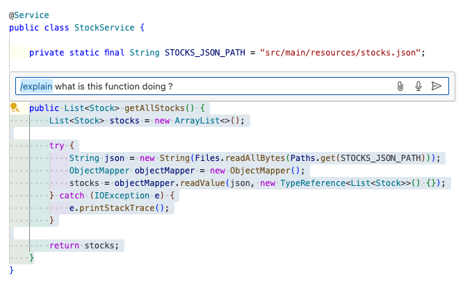
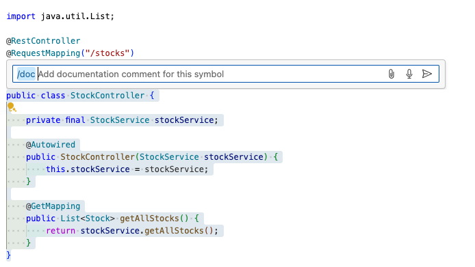
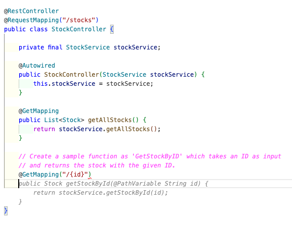
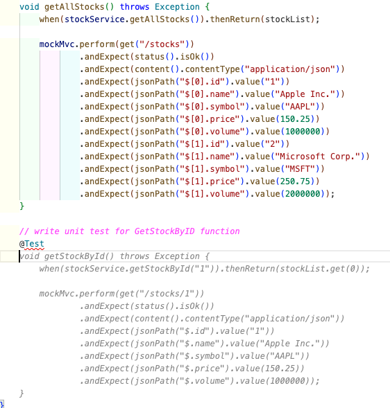
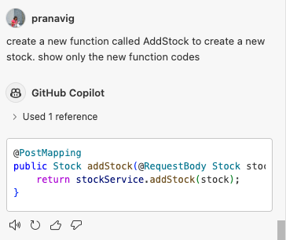
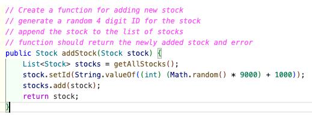
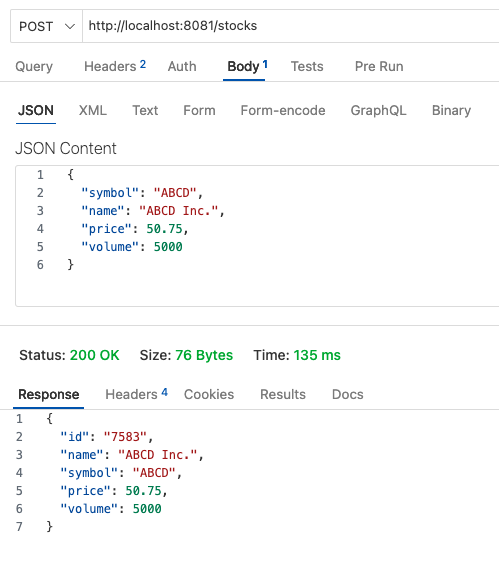

## Core exercise

The following exercises will help you get started with GitHub Copilot. You must have completed the [setup instructions](./01-setup.md) before starting these steps.

### Step by Step Instructions
<details>
<summary>Understanding the existing application</summary>

1. Folder Structure 
    * _The folder and file structure is that of a simple java spring boot application. Read more details in [project.md](../project.md)_ 

2. Explain Code
    - @workspace
        - Avoid more generic responses.
        - `@workspace How do I build this project ?`
        - `@workspace where's the code that adds request headers ?`

        _**Tip**: Workspaces can be big, so we can't feed in all this info to the copilot. So we include `File references`, `Relevant codes` into the `context`_
    
    - Make sure you are in the `src` folder of this repository.
    - Navigate to `main` folder and `service/StockService.java` and Select all the lines of code in `getAllStocks` function
        - In the sidebar chat, type `@workspace where is this #selection being used ?` and press **Enter**
        - Press `cmd+I` (or) `Ctrl+I`, When the Copilot Inline Assistant Opens, type `/explain what is this function doing ?`

            

3. Ask copilot some questions on the existing codes.
    - Open the sidebar copilot chat extension, you should already see the previous suggestions there.
    - Let's ask some follow up questions on the same code block.
        - Type `Is this code following all error handling and validations ?` and press **Enter**.
        
            _Not using @workspace here, but since editor selection provides the first level of context, the suggestions work well_
        
        - _Let's ignore these suggestions for now_
    - Navigate to `model/Stock.java` and move to the end of this file.
        - You can see a comment as `// Explain the contents of this file. What is the purpose of this class?`. At the end of this line, press `Ctrl + Enter`.
        
            _This should open the copilot suggestions pane explaining the model in different ways_

    - Select any other lines of code and click `cmd+I` (or) `Ctrl+I` to open the copilot inline assistant.
        - Type `/explain what does this code mean` and press `Enter`

            _You can notice the copilot sidebar open with detailed explanation of what this syntax means_

    - Navigate to `controller/StockController.java` and select the **entire class**. Press `cmd+I` (or) `Ctrl+I` and type `/doc` and **Enter**. You can see the explanation of this function generated inline. Please **Accept** the summary.
    
        

    _**Tip**: Be Precise about what you want_
</details>

<details>
<summary>Adding functionality using Github Copilot</summary>

* Convert Comment to Code
* Prompt engineering to improve the suggestion - being specific with a user story
* Keyboard shortcuts. 
* Alternate Suggestions

1. TDD
    - Create a Unit Test for 'GetStockByID' endpoint
        - Navigate to `controller/StockController.java`, move the cursor to the end of the file and add the comment `// Create a sample function as 'GetStockByID' which takes an ID as input` and press **Enter**

            _You should see the copilot suggestion for the new function, something like below.
            
            

            **Tip**: Make sure the function here only has `return null` for now, as we want to write unit tests first for TDD.

        - Navigate to `service/StockService.java` to create a dummy function for TDD.

            ```java
            public Stock getStockById(String id) {
                // TODO Auto-generated method stub
                throw new UnsupportedOperationException("Unimplemented method 'getStockById'");
            }
            ```

        - Navigate to outer tests directory, `StockTickerApplicationTests.java`, move the cursor to the end of the file and add the comment `// write unit test for GetStockByID function` and press `Enter`

            _Press **Tab** to accept the copilot suggestion_

            

            - Please click on `Play` button beside the function to run the test (or) `mvn test` in your terminal. You should see that the test passed successfully, since we are only asserting nil in the test case.

                ```java
                @Test
                void getStockById() throws Exception {
                    when(stockService.getStockById("1")).thenReturn(stockList.get(0));

                    mockMvc.perform(get("/stocks/1"))
                            .andExpect(status().isOk())
                            .andExpect(content().contentType("application/json"))
                            .andExpect(jsonPath("$.id").value("1"))
                            .andExpect(jsonPath("$.name").value("Apple Inc."))
                            .andExpect(jsonPath("$.symbol").value("AAPL"))
                            .andExpect(jsonPath("$.price").value(150.25))
                            .andExpect(jsonPath("$.volume").value(1000000));
                }
                ```

    - Create endpoint logic from unit tests (TDD)
        - Navigate to `service/StockService.java` file, select the entire function `getStockById`.
        - Open Copilot sidebar chat and type `correct the function in #file:StockService.java  based on the unit test written in #file:StockTickerApplicationTests.java `

            **Tip**: You can use `#file` command to include certain files in the context

            _A sample response from copilot is as below:_

            ```java
            public Stock getStockById(String id) {
                List<Stock> stocks = getAllStocks();
                Optional<Stock> stock = stocks.stream()
                        .filter(s -> s.getId().equals(id))
                        .findFirst();
                return stock.orElseThrow(() -> new RuntimeException("Stock not found"));
            }
            ```

        - Stop the java runtime in terminal and rerun ```mvn spring-boot:run``` to test the changes in browser **http://localhost:8081/stocks/1**

2. Create a new endpoint for `Add Stock` and add unit tests.
    - Open the file `controller/StockController.java` in the editor. Go to the end of the file and place your cursor there.
    - Click on the Copilot sidebar chat and type `create a new function called AddStock to create a new stock. show only the new function codes` and press **Enter**
    - Hover on the suggested code block and click on the `Insert at Cursor` menu item. _You should see the new codes added at the end of the file in the editor_
        
        

    - Navigate to `service/StockService.java` and correct the `addStock` function. There are a couple of ways to do this.
        1. Using sidebar chat
            - Continue chatting with copilot in the sidebar to enhance this function.
            - Type `Update the **AddStock** function to be able to generate a new 4 digit random ID for stock before appending to stocks list and return the new stock and error as response` and press Enter.
                - Follow the suggestions to update the codes.

                    **Tip**: Don't worry if you see different suggestions, they do work.
                
                    ```java
                    public Stock addStock(Stock stock) {
                        List<Stock> stockList = getAllStocks();
                        // Generate a new 4-digit random ID
                        Random random = new Random();
                        String newId = String.format("%04d", random.nextInt(10000));
                        stock.setId(newId);

                        // Add the new stock to the list
                        stockList.add(stock);

                        return stock;
                    }
                    ```
                **(or)**
        2. Using context crafting / user story inline
            - Navigate to the end of the `service/StockService.java` file, delete the function **addStock** and add the following user story comments to the end of the file.
                ```js
                // Create a function for adding new stock
                // generate a random 4 digit ID for the stock
                // append the stock to the list of stocks
                // function should return the newly added stock and error
                ```
            - Press **Enter** at the end of the 4th line of this comment.
            - _Copilot will start suggesting the function, use `Tab` to accept the suggestions_

                ```java
                public Stock addStock(Stock stock) {
                    List<Stock> stocks = getAllStocks();
                    stock.setId(String.valueOf((int) (Math.random() * 9000) + 1000));
                    stocks.add(stock);
                    return stock;
                }
                ```
                
            
            **Tip:** In cases where your imports are not automatically added, you might see some errors on this function. Try to fix this using copilot - Right click (Context Menu)-> Copilot -> Fix this. **(or)** Use `/fix` in the inline copilot assistant to do the same.

        _**Tip**: The ghost suggestions from copilot are for most part considering the lines within the file and opened tabs in editor before suggesting codes. There should suffice for simple development needs, if you are following a standard process within your workspace_

    - Rerun with `mvn spring-boot:run` to test the new end point.

        _Note: The StockID is auto generated by our codes_

        - Use Thunderclient in VSCode to call the endpoint as below

            

            (or)

            ```bash
            curl  -X POST \
                'http://localhost:8081/stocks' \
                --header 'Content-Type: application/json' \
                --data-raw '{
                "symbol": "ABCD",
                "name": "ABCD Inc.",
                "price": 50.75,
                "volume": 5000
                }'
            ```
    - Don't forget the unit tests. Try a few options, by providing more prompts to make the logic more specific

        

        - Navigate to `StockTickerApplicationTests.java`, to the end of the file and pressing **Enter** will start suggesting new tests automatically.

            (or)

        - Select the function in `service/StockService.java` and Open the copilot sidebar chat and type `@workspace /tests generate unit tests in #file:StockTickerApplicationTests.java  for this addstock function`


3. **Optionally**, Let's do some complex logics. Add an endpoint for `UpdateStocks`
    - Navigate to `controller/StockController.java` and `service/StockService.java` and add a user story at the end of the file
        ```js
        // Create a function for updating multiple stocks at once. 
        // The inputs can be multiple stock symbols with volumes to add for each stock
        // The function should return the updated list of stocks
        ```
    - Press `Enter` and `Tab` to accept the suggestions. The working code should look like below.
    
    **Tip**: Make sure the relevant files are open in the editor as the context is shared for the copilot suggestion.
</details>

<details>
<summary>Exploring features</summary>

1. Add documentation to the codes.
    - Select contents of any file and press `cmd+I` (or) `Ctrl+I` to open the inline copilot assistant.
        - Type `/doc` and Press `Enter`. This should add all inline comments and summary to all the functions within the file.
    - Open the Copilot Sidebar chat and type `#file` -> select `controller/StockController.java` file and type `Create a openAPI specification file for this API`.
        - Feel free to save the yaml file for reference later.
2. Add error handling to the codes.
3. `#` commands 
    - `#file`
    - `#selection`
    - `#terminalLastCommand`
    - `#terminalSelection`
4. `@terminal` - ask how to do something in the terminal
5. AI prompts
    - Q&A Strategy
        ```
        @workspace Propose a file/folder structure for this project and the files in src folder. Ask me a series of yes/no questions that will help you provide a better recommendation.
        ```
    - Pros & Cons Strategy
        ```
        what are a few different ways that I can implement this db connection logic. give a pros and cons of each strategy. #file:StockService.java 
        ```
        ```
        rewrite the code in (1) strategy #file:StockService.java
        ```
        _Note: Possible vulnerabilities in the code suggestion are also shared in the chat._

        ```
        How do I use this in my app ?
        (or)
        How can I implement dependency injection in my client-side application to use the above approach?
        ```
    - Stepwise chain of thought
        ```
        Help me refactor the code in #file:StockService.java. Go one step at a time. Do not move to next step until I give the keyword 'next'
        ```
    - Role prompt
        ```
        @workspace You are a skilled Go instructor who makes complex topics easy to understand. You come up with fun exercises so that all your students can learn by doing. You goal is to teach students how to convert the current app from java to golang. Move one step at a time and wait for the student to provide the correct answer before you move on to the next concept. If the student provides the wrong answer, give them a nudge.
        ```

    _**Tip**: Don't treat Copilot as a search engine, instead more like a conversation with more follow up questions._

    - Some Limitations (For now...)
        - Fix all the bugs in this project (Too broad to understand what counts as a bug for you)
        - Intellisense type of questions. Normal VSCode intellisense works well here.
            - Ex: How many times is this symbol used ? - like find all references
        - Who's contributed to this file ?
            - Only looks at files that are in the current project.
</details>

---
> NEXT [> Proceed to Challenges](./03-devops.md)

> PREVIOUS [< Go back to main instructions](../Readme.md)